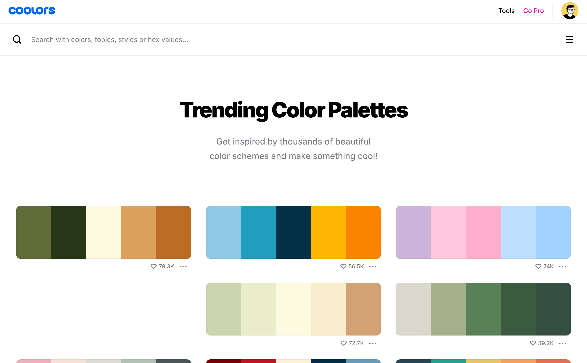

## Setup csTimer
- `display/zoom`: 90%
- `display/UI design is`: Material design w/o shadows
- `display/backgroudImage`: manual

## Installation
You can use extensions that support CSS injection, such as Stylish or Tampermonkey. Here, we'll use Tampermonkey to inject CSS.

1. Download  [Tampermonkey](https://chrome.google.com/webstore/detail/tampermonkey/dhdgffkkebhmkfjojejmpbldmpobfkfo) ( Chrome, Microsoft Edge, Safari, Opera Next, and Firefox.)

2.  Turn on dev mode extenstion

3. Click [here](https://raw.githubusercontent.com/huybach1609/cstime-theme/main/script.use.js) to install script 
4. Refresh page to apply theme

- It's recommended to add a background image to take blur effect.
- you can change font follow your browser (Monaco, arial, ...)


## Theme

Change theme by pick color scheme from this [theme.css](theme.css). Then replace old theme in script from Tampermonkey ([scrip.use.js](script.use.js))


### Gruvbox
[image theme](https://gruvbox-wallpapers.pages.dev/wallpapers/minimalistic/ALLqk82.png)


### Dracular:
[image theme](https://encrypted-tbn0.gstatic.com/images?q=tbn:ANd9GcSCY6E8RyRRsFeP-9cjYLFAE2NVIZe3lUjPfA&s)


### Catppuccin Theme (Mocha Flavor)


### Iceberg Theme
[image Link](https://w0.peakpx.com/wallpaper/671/687/HD-wallpaper-white-iceberg-high-quality.jpg)


### Green theme
[image link](https://preview.redd.it/2560x1440-forest-stairs-everforest-theme-v0-7sgj3074v5gc1.jpeg?auto=webp&s=6ee8953f3a913b7e63da1218a009797c316ae688)


### create your own theme
1. Pick color from scratch
- Pick color palette from [coolors](https://coolors.co/)
- choose them in RBG format 

```
    --text-0: 251, 73, 52; /*text highlight*/
    --text-1: 235, 219, 178; /*primary text*/
    --text-1-shadow: 235, 219, 178;  /*primary text shadow*/
    --text-2: 184, 187, 38; /*secondary text*/ 
    --text-2-shadow: 184, 187, 38; /*secondary text shadow*/

    --bg-0: 40, 40, 40; /background color - 0/
    --bg-1: 60, 56, 54; /background color - 1/
    --bg-2: 50, 48, 47; /background color - 2/
```


2. Using AI
- Choose a theme from [vim themes](https://vimcolorschemes.com/)
- Pick a name then as AI to generate.


