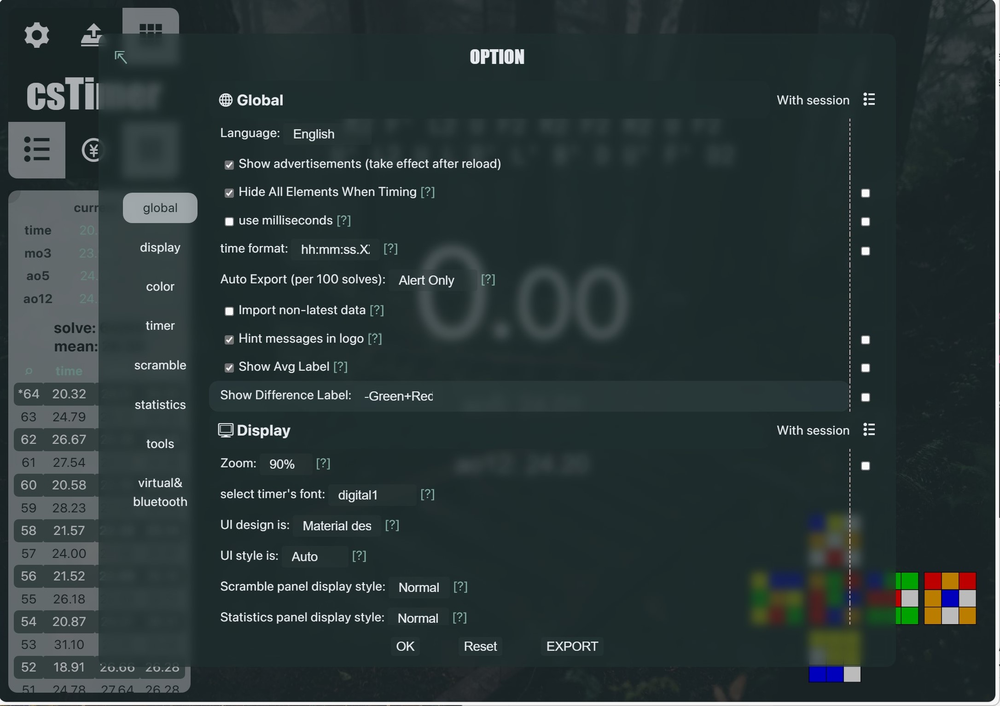

## Setup csTimer
- `display/zoom`: 90%
- `display/UI design is`: Material design w/o shadows`
- `display/backgroudImage`: custom

## Installation
You can use extensions that support CSS injection, such as Stylish or Tampermonkey. Here, we'll use Tampermonkey to inject CSS.

1. Download  [Tampermonkey](https://chrome.google.com/webstore/detail/tampermonkey/dhdgffkkebhmkfjojejmpbldmpobfkfo) ( Chrome, Microsoft Edge, Safari, Opera Next, and Firefox.)

2.  Turn on dev mode extenstion

3. Click [here](https://raw.githubusercontent.com/huybach1609/cstime-theme/main/script.use.js) to install script 
4. Refresh page to apply theme

- It's recommended to add a background image to take blur effect.
- you can change font follow your browser (Monaco, arial, ...)

## Theme
Theme: [theme.css](https://github.com/huybach1609/cstime-theme/blob/main/theme.css)

### Gruvbox
[image theme](https://gruvbox-wallpapers.pages.dev/wallpapers/minimalistic/ALLqk82.png)

### Dracular:
[image theme](https://encrypted-tbn0.gstatic.com/images?q=tbn:ANd9GcSCY6E8RyRRsFeP-9cjYLFAE2NVIZe3lUjPfA&s)

### Catppuccin Theme (Mocha Flavor)

### Iceberg Theme
[image Link](https://w0.peakpx.com/wallpaper/671/687/HD-wallpaper-white-iceberg-high-quality.jpg)

### Green theme
[image link](https://preview.redd.it/2560x1440-forest-stairs-everforest-theme-v0-7sgj3074v5gc1.jpeg?auto=webp&s=6ee8953f3a913b7e63da1218a009797c316ae688)

